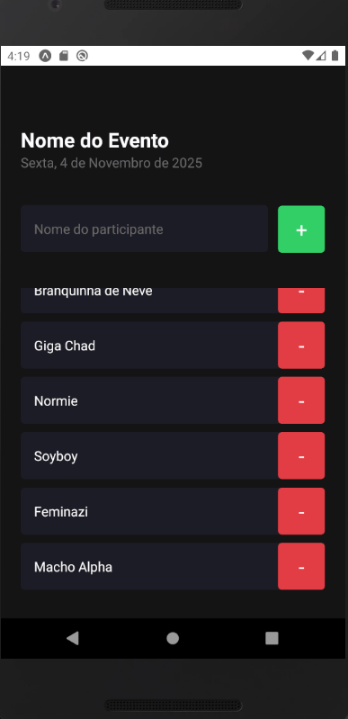

# First Level - Fundamentals

This is an [Expo](https://expo.dev) project created with [`create-expo-app`](https://www.npmjs.com/package/create-expo-app).

## Get started

1. Install dependencies

   ```bash
   npm install
   ```

2. Start the app

   ```bash
    npm start
   ```

## The project

Here we build a simple app to add and remove participants to learn about fundamentals topics in React and React-Native.
It was learned:

- What is Expo;
- What is React-Native;
- How to run a React-Native app environment;
- Showing Alerts;
- Differences between Flatlist and ScrollView;
- How to Debug.

Here's a screen of the app:

